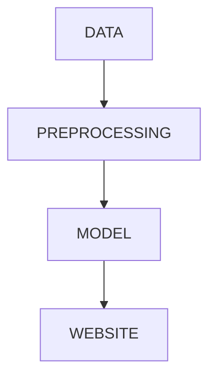

# Movie Recommender System

**Overview**
This is a content-based movie recommender system which uses cosine similarity to predict similar movies. Tags are created for content-based similarity matching to display the required results.

**Tech Stack**
Languages - Python
Developer Tools - PyCharm, Jupyter notebook

**Project Flow**

