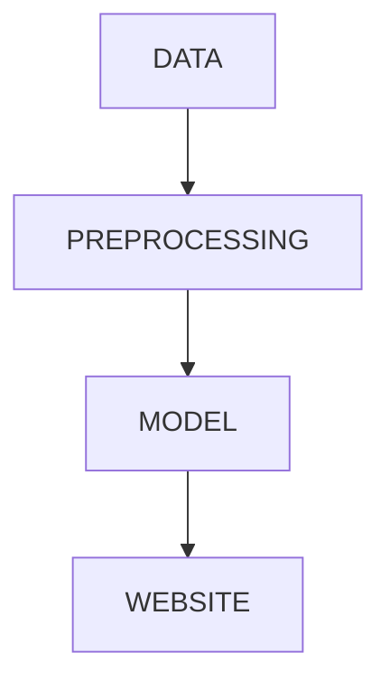

# Movie Recommender System

**Overview**
This is a content-based movie recommender system which uses cosine similarity to predict similar movies. Tags are created for content-based similarity matching to display the required results.

**Tech Stack**
Languages - Python
Developer Tools - PyCharm, Jupyter notebook
API - tmdb API is used 

**Project Flow**

**How to run**
* Clone the project to your device
* Download the dataset  - https://www.kaggle.com/datasets/tmdb/tmdb-movie-metadata?select=tmdb_5000_movies.csv
* Place the dataset in the project folder
* Compile and run Jupyter notebook
* Create a virtual environment in Pycharm and place code file and app.py file in it
* Place movies.pkl and similarities.pkl (generated files) in the project folder
* in terminal wirte - streamlit run app.py

**tmdb API**
It is used to fetch movie posters from the site

**Result**
The given system matches and compares the nearest distance of the input movies to all the movie vectors and generates output with required number of least distant movie vectors. 

**HOMEPAGE**
 

 **Drop Down Menu (you can type also)**
  

  **Results**

 

